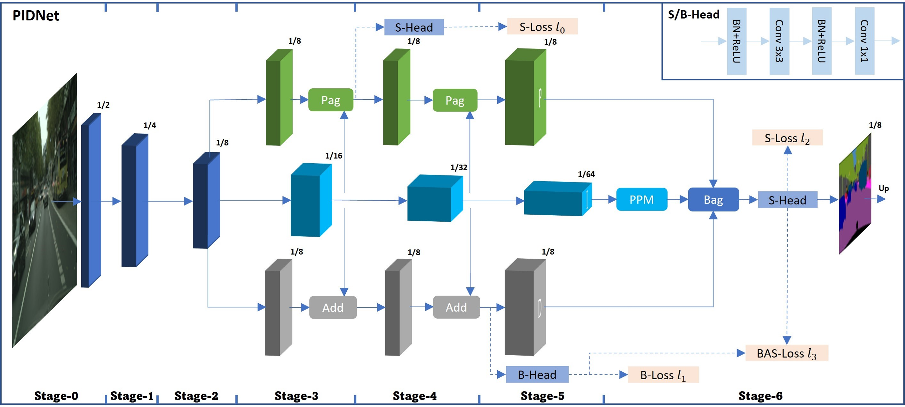
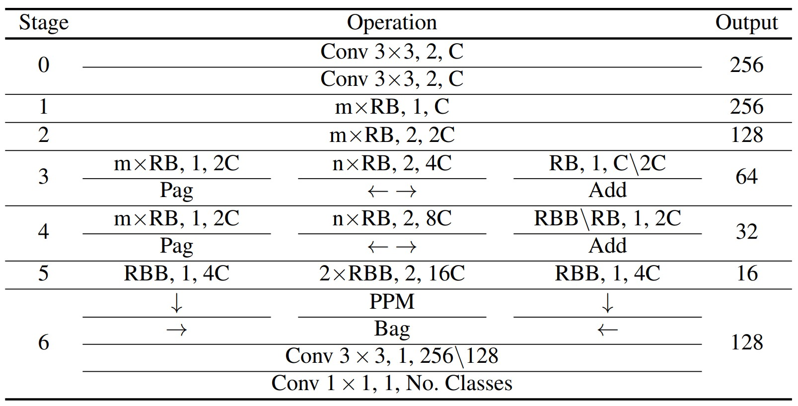

# [PIDNet](https://arxiv.org/pdf/2206.02066.pdf)  [](https://hits.seeyoufarm.com)      <a href="/LICENSE"></a>
<!-- https://hits.seeyoufarm.com/ -->

[](https://paperswithcode.com/sota/real-time-semantic-segmentation-on-camvid?p=pidnet-a-real-time-semantic-segmentation)   [](https://paperswithcode.com/sota/real-time-semantic-segmentation-on-cityscapes?p=pidnet-a-real-time-semantic-segmentation)   [](https://paperswithcode.com/sota/real-time-semantic-segmentation-on-cityscapes-1?p=pidnet-a-real-time-semantic-segmentation)
## PIDNet: A Real-time Semantic Segmentation Network Inspired from PID Controller 

` Hit star ⭐ if you find my work useful. `

This repository contain implementation of all three versions of PIDNet in Tensorflow/Keras.


## Overview
<p align="center">
  </br>
  <span align="center">An overview of the basic architecture of our proposed Proportional-Integral-Derivative Network (PIDNet). </span> 
</p>
P, I and D branches are responsiable for detail preservation, context embedding and boundary detection, respectively.

### Detailed Implementation
<p align="center">
  </br>
  <span align="center">Instantiation of the PIDNet for semantic segmentation. </span> 
</p>
For operation, "OP, N, C" means operation OP with stride of N and the No. output channel is C; Output: output size given input size of 1024; mxRB: m residual basic blocks; 2xRBB: 2 residual bottleneck blocks; OP<sub>1</sub>\OP<sub>2</sub>: OP<sub>1</sub> is used for PIDNet-L while OP<sub>1</sub> is applied in PIDNet-M and PIDNet-S. (m,n,C) are scheduled to be (2,3,32), (2,3,64) and (3,4,64) for PIDNet-S, PIDNet-M and PIDNet-L, respectively.


```
Dependies:
Tensorflow 2.3 or later
```

Licensed under [MIT License](LICENSE)
